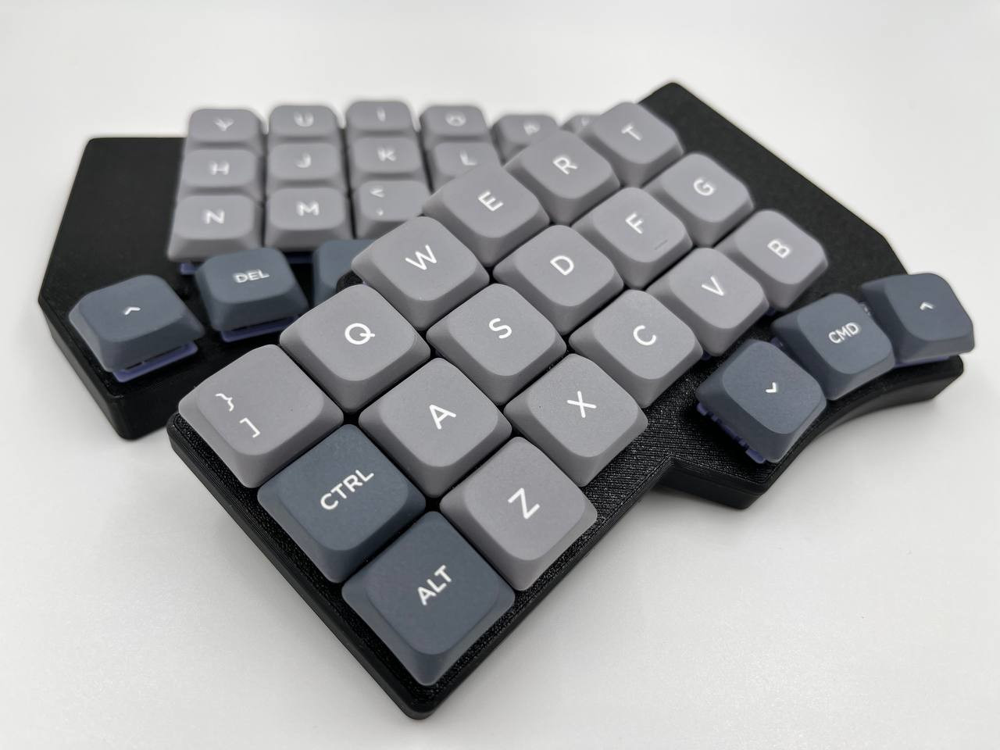

# Ergonaut Zero

*Ergonaut Zero in Modern Case*

Ergonaut Zero is fork for an open-source ergonomic wireless split mechanical keyboard Ergonaut Zero designed by Ergonaut Keyboards.
It's based on RP2040 Zero MCU and use wire between split, unlike original.

## Features

* Low-profile, which will reduce strain on your beautiful hands;
* Split. You can put the keyboard where it'll be comfortable exactly for you;
* Wide availability and range of [compatible keycaps](https://ergonautkb.com/docs/switches/gateron-low-profile#keycaps-compatibility);
* Easily replaceable [switches](https://ergonautkb.com/docs/switches/gateron-low-profile#ks-33-v2) thanks to hot-swap sockets;
* Budget-friendly, because:
  * It uses relatively cheap and widely available RP2040 Zero as MCU;
  * It uses one PCB design for both halves of the keyboard;
  * Everything except PCB's, components and hardware (screws, nuts) can be 3D printed.
* Beginner-friendly, because:
  * PCB is easy to solder;
  * Cases are easy to print.
* Free in terms of hardware design. It's licensed under permissive [CERN-OHL-P v2](https://ohwr.org/cern_ohl_p_v2.pdf) license, which means:
  * you are free to manufacture it yourself;
  * you are free to sell your manufactured hardware for profit.

## Build Guide

In progress

## Firmware

Firmware can be found in this repository.

## Gerbers

REPLACE!!

| Front                                            | Back                                                 |
| ------------------------------------------------ | ---------------------------------------------------- |
|  |  |

* [Gerbers for JLCPCB](../../releases/latest/download/pcb-JLCPCB_gerbers.zip)
* [Gerbers for PCBWay](../../releases/latest/download/pcb-PCBWay_gerbers.zip)

## Contacts

* Documentation portal of original board: https://ergonautkb.com
* Telegram of original board: https://ergonautkb.t.me
* Telegram of original board (ru): https://ergonautkb_ru.t.me
* 
